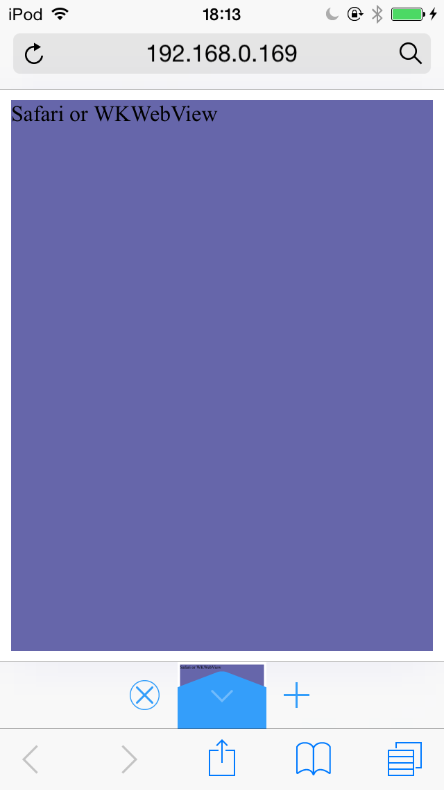
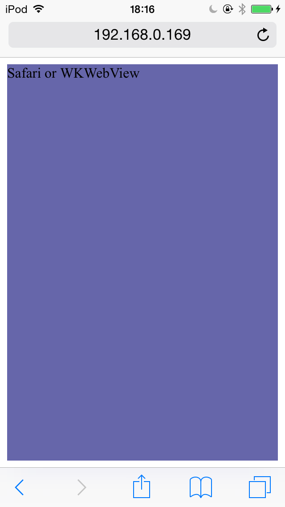

# iOS WebViewJudger
Open index.html by your browser.
Then, index.html shows what you're using either "UIWebView" or "WKWebView or Safari".

## Example
### UIWebView - Google Chrome

### WKWebView - Sleipnir

### Safari
